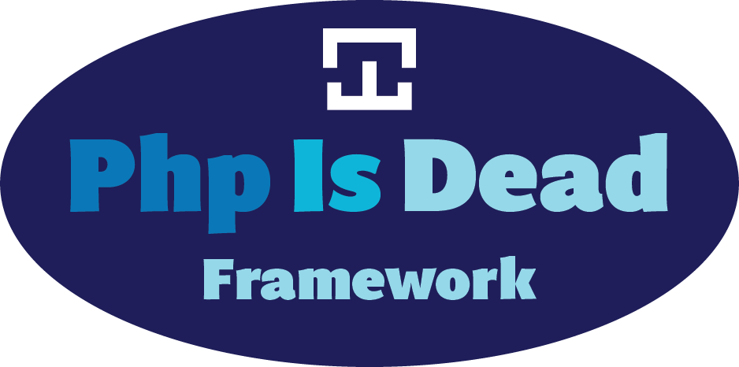

PhpIsDead is a php framework

# Dev

1. run "composer dump-autoload -o" instead of "composer dump-autoload" to see if any error to generate the autoloader

2. push to github

3. click "update" in https://packagist.org/packages/quantr/phpisdead

4. in your project, rm -fr package.lock vendor

5. composer install

6. you can see the changes


# Useful link

https://dev.to/joemoses33/create-a-composer-package-how-to-29kn

# The framework

## Install

Create sample project by 

```
composer create-project quantr/phpisdead-sample-project:dev-main
```

## Startup

The main file is index.php

```php
<?php

require_once 'vendor/autoload.php';

use \Quantr\PhpIsDead\PhpIsDead;
use \Quantr\PhpIsDead\Controller;
use \Quantr\PhpIsDead\Request;

class IndexController extends Controller
{
	function index(Request $request) {}
	public static function a(Request $request)
	{
		echo "this is a<br>";
	}
}

$phpIsDead = new PhpIsDead();
$phpIsDead->start();
$phpIsDead->router->add('/index', IndexController::class, 'index');
echo $phpIsDead->router->toString();

$phpIsDead->router->process($_SERVER['REQUEST_URI']);
```

## Route

To add a route to a class function, do this

```php
$phpIsDead->router->add('/index', IndexController::class, 'index');
```


## Authentication

## Authorization

## Model

## Controller

## ORM

**Introduction to Our New ORM Framework**

In the ever-evolving landscape of web development, the need for efficient and intuitive database management has never been more critical. Enter our new ORM (Object-Relational Mapping) framework—a powerful tool designed to streamline database interactions and enhance developer productivity.

Inspired by established frameworks like Eloquent, our ORM aims to provide a seamless and elegant interface for managing database operations. With a focus on simplicity and flexibility, we've built a framework that allows developers to interact with their databases using expressive syntax, making data manipulation both intuitive and enjoyable.

**Key Features**
- Active Record Implementation: Each model corresponds directly to a database table, allowing for straightforward CRUD operations.
- Eager Loading: Optimize performance by loading related data in a single query, reducing the number of database calls.
- Query Builder: A fluent interface for constructing complex queries programmatically, ensuring both readability and maintainability.
- Migration Support: Easily manage database schema changes with version control, allowing for smooth transitions in your application’s evolution.
- Validation and Relationships: Built-in validation rules and relationship management simplify data integrity and enhance relational database capabilities.

**Why Choose Our ORM?**

- Developer-Friendly: Our framework prioritizes usability, enabling developers to focus on building features rather than managing database intricacies.
- Extensible: Designed with extensibility in mind, you can easily add custom functionality to meet your specific requirements.
- Community-Driven: We value community feedback and contributions, ensuring that our framework evolves alongside the needs of developers.

### Example 1 - Read record

Get the user record by id = 1

```php
$record = $User->get(1);
```

### Example 2 - Read all records

```php
$records = $User->getAll();
var_dump($records);
```

### Example 3 - Read all records with joining table

```php
$records = $User->articles->getAll();
var_dump($records);
```

## DB Migration

## Notification

## Mail

## Storage

## Queue

## Task Scheduling

## Testing

## Events & WebSocket

## Log

## API

## CSRF

## Session

## Template Engine
